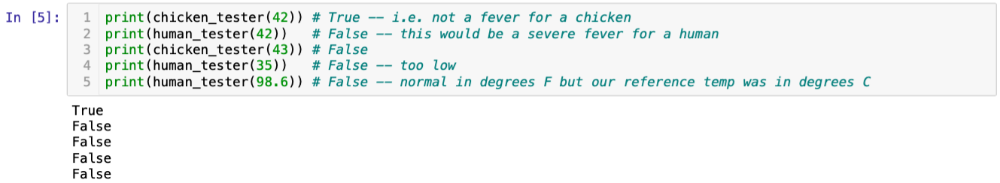
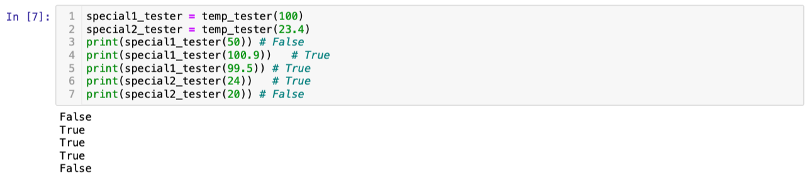
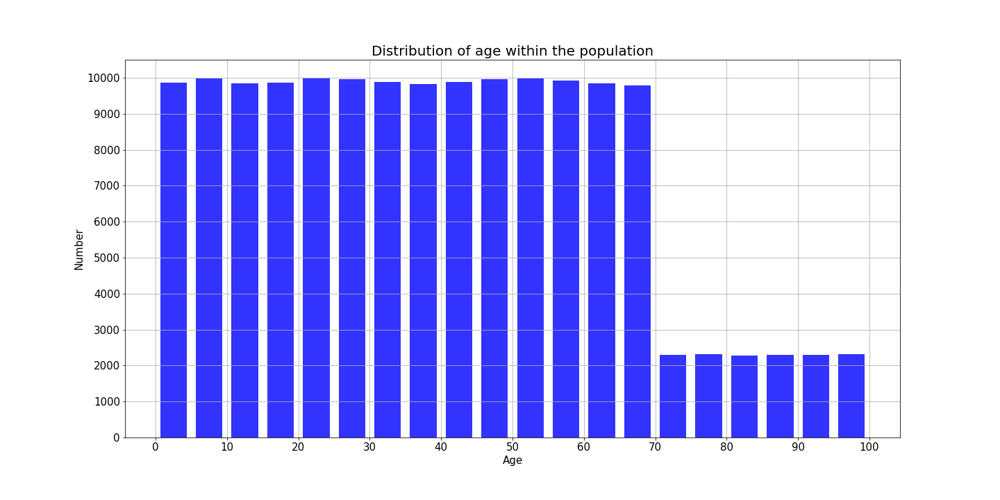
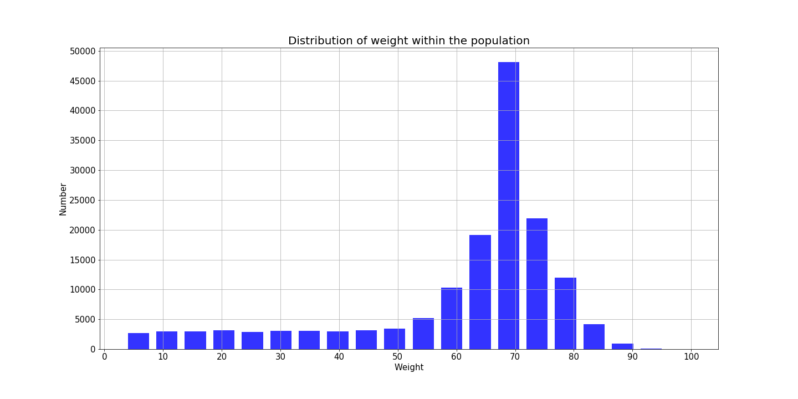
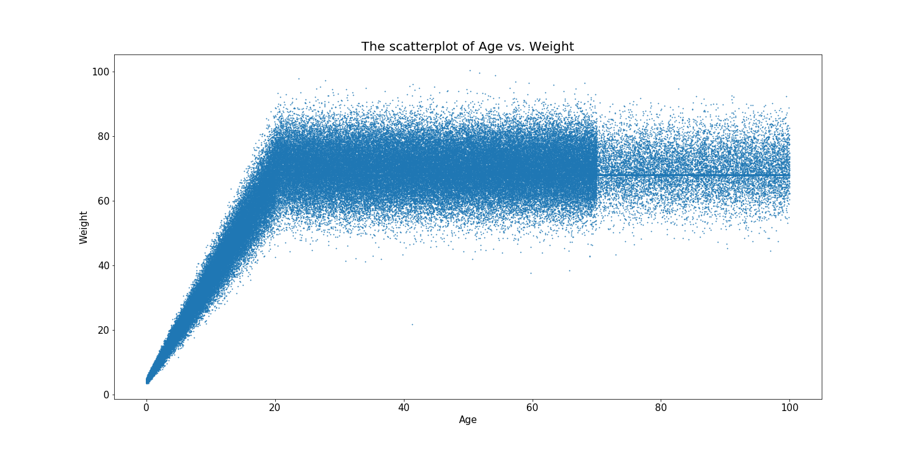
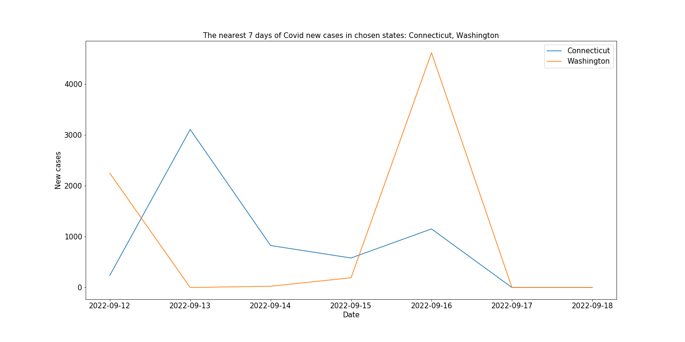
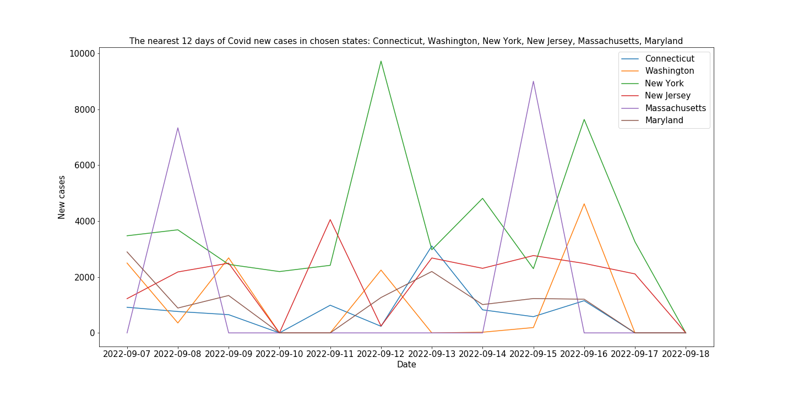
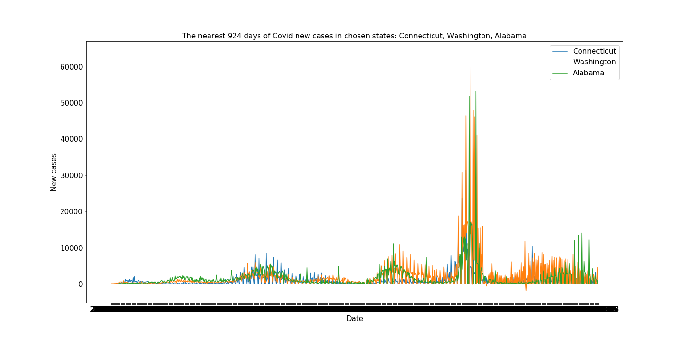
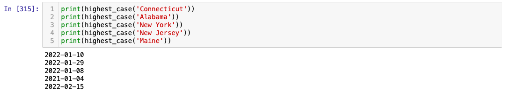
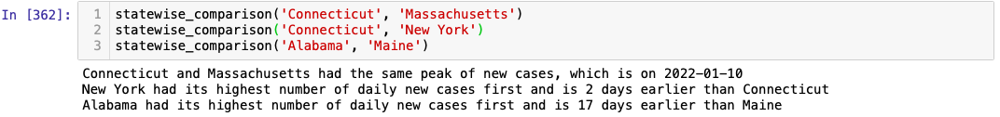

<h1 align = "center">BIS634 - Assignment1</h1> 
<p align="right">Name: Zhiyuan Cao; NetID: zc347</p>

## Exercise 1

I have written the code for EX1 in jyupter notebook and test the code using the sample testcase. The result is shown below.



After that, I designed some testcase to check whether the code still works. The result is shown below. 




## Exercise 2

1. The data has four columns: name, age, weight, and eyecolor.

2. It has 152361 rows.

3. The distribution of age:

   | age  |           |
   | :--: | :-------: |
   | mean | 39.510528 |
   | std  | 24.152760 |
   | min  | 0.000748  |
   | 25%  | 19.296458 |
   | 50%  | 38.468955 |
   | 75%  | 57.623245 |
   | max  | 99.991547 |

4. Then the historgram of the data is plotted. The figute is shown below:

   

   Here, I choose the number of bins to be ***20***. This is because the age in this dataset mainly ranges from 0 to 100. Thus each bin stands for a range of 5 years. Besides, 20 bins are appropriate to have a clear and detailed visualization of the dataset. 

   There is no significant outliers detected. For patterns, population with an age of 0 - 70 greatly exceeds those aged 70 - 100, and the number of people in similar age groups are close. 

5. Then we do a similar thing with weight:

6. The distribution of weight:

   | Weight |            |
   | :----: | :--------: |
   |  mean  | 60.884134  |
   |  std   | 18.411824  |
   |  min   |  3.382084  |
   |  25%   | 58.300135  |
   |  50%   | 68.000000  |
   |  75%   | 71.529860  |
   |  max   | 100.435793 |

7. Then the historgram of the data is plotted. The figute is shown below:

   

   Here, I still choose the number of bins to be ***20***, because 20 bins are appropriate to have a clear and detailed visualization of the dataset. Too much bins may seems crowded and hard to read, while too less bins may makes it difficult to observe the trend and distribution of the dataset. 

   There is no significant outliers detected. Generally, most of the people has a weight around 68 kg. The pattern follows a skewed normal distribution and is in line with our common sense.  

8. The scatter plot is shown below:

   

9. From the plot, we can observe that when age is smaller than 20, age and weight have a strong correlation with each other: The weight increases with the increase of age. After around 20 years old, the weight stablizes at aroung 60 - 85 kg. Also, people aged between 20 to 100 seems to have a larger standard deviation of weight. 

10. Note that there is an outlier on the graph, who is named **Anthony Freeman**. I observe that because a person aged roughly 42 years old has an abnormally low weight which is close to 25 kg. Then I write a code to sort out person with age larger than 40 but weight smaller than 30. The outlier Anthony Freeman is then found.


## Exercise 3

***Data Source***: The data for this exercise is downloaded from https://raw.githubusercontent.com/nytimes/covid-19-data/master/us-states.csv by 18 Sep, 2022. The data source is **The New York Times**.  


1. I wrote a function `plot_cases_bystate(state_list, case_period=None)` which "takes a list of state names and plots their new cases vs date using overlaid line graphs, one for each selected state." (cited from BIS 634 HW1)

2. Then I tested my code and here are three examples.

   - `plot_cases_bystate(['Connecticut', 'Washington'], 7)` gives:

   

   - `plot_cases_bystate(['Connecticut', 'Washington', 'New York', 'New Jersey', 'Massachusetts', 'Maryland'], 12)` gives:

   

   - `plot_cases_bystate(['Connecticut', 'Washington', 'Alabama'])` gives:

   

3. However, the function has some limitations:

   - When analyzing the trend of covid new cases in a long time range, the x-axis will overlap with each other and makes it impossible to read.  Some easy solutions may be rotating the label to be vertical or magnifying the graph. To aviod this issue, the xticks should be changed so that the step length is not one day but one month or some specific period depending on the data size. 
   - The lines all crowded in one graph. Thus if we want to plot all the 50 states, it is difficult to observe the trend for a single state.
   - The functions can only takes a list of valid state names. Error will occur otherwise. 

4. After that, I wrote a function that takes the name of a state and returns the date of its highest number of new cases. The test cases are shown below.

   

5. Finally, I wrote a function that takes the names of two states and reports which one had its highest number of **daily** **new** cases first and how many days separate that one's peak from the other one's peak. The test cases are shown below.

   


## Exercise 4

In this exercise, I read the XML file using Python. The XML file is downloaded from https://nlmpubs.nlm.nih.gov/projects/mesh/MESH_FILES/xmlmesh/.

1. The DescriptorName associated with DescriptorUI D007154 is "**Immune System Diseases**".

2. The DescriptorUI associated with DescriptorName "Nervous System Diseases" is "**D009422**".

3. The DescriptorNames of items in the MeSH hierarchy that are children of both "Nervous System Diseases" and D007154 is:

   ```xml
   Autoimmune Hypophysitis
   Ataxia Telangiectasia
   Diffuse Cerebral Sclerosis of Schilder
   Encephalomyelitis, Acute Disseminated
   Encephalomyelitis, Autoimmune, Experimental
   Leukoencephalitis, Acute Hemorrhagic
   Kernicterus
   Multiple Sclerosis
   Myasthenia Gravis
   Myelitis, Transverse
   Neuritis, Autoimmune, Experimental
   Neuromyelitis Optica
   Polyradiculoneuropathy
   Giant Cell Arteritis
   Uveomeningoencephalitic Syndrome
   AIDS Dementia Complex
   Lambert-Eaton Myasthenic Syndrome
   Stiff-Person Syndrome
   POEMS Syndrome
   Miller Fisher Syndrome
   Autoimmune Diseases of the Nervous System
   Guillain-Barre Syndrome
   Polyradiculoneuropathy, Chronic Inflammatory Demyelinating
   Demyelinating Autoimmune Diseases, CNS
   Vasculitis, Central Nervous System
   Multiple Sclerosis, Chronic Progressive
   Multiple Sclerosis, Relapsing-Remitting
   Myasthenia Gravis, Autoimmune, Experimental
   Nervous System Autoimmune Disease, Experimental
   Myasthenia Gravis, Neonatal
   AIDS Arteritis, Central Nervous System
   Lupus Vasculitis, Central Nervous System
   Mevalonate Kinase Deficiency
   Microscopic Polyangiitis
   Anti-N-Methyl-D-Aspartate Receptor Encephalitis
   ```

4. The above research has found that each of these diseases (Autoimmune Hypophysitis, Ataxia Telangiectasia, etc.) is a subtype of both Immune System Diseases and Nervous System Diseases, because the their tree numbers includes C20 (representing Immune System Diseases) and C10 (representing Nervous System Diseases). For example, Autoimmune Hypophysitis is a subtype of Immune System Diseases, and it is also a subtype of Nervous System Diseases.

5. Finally, I do all these tasks using functions rather than writing single use code. The detailed can be seen in the code. Specifically, for example,

   - `UI2Name(root, 'D007154')` gives the output 'Immune System Diseases'.

   - `Name2UI(root, 'Nervous System Diseases')` gives the output 'D009422'.

   - `subtype_of_both(root, 'Immune System Diseases', 'Nervous System Diseases')` gives the output 

     ```xml
     Autoimmune Hypophysitis
     Ataxia Telangiectasia
     Diffuse Cerebral Sclerosis of Schilder
     Encephalomyelitis, Acute Disseminated
     Encephalomyelitis, Autoimmune, Experimental
     Leukoencephalitis, Acute Hemorrhagic
     Kernicterus
     Multiple Sclerosis
     Myasthenia Gravis
     Myelitis, Transverse
     Neuritis, Autoimmune, Experimental
     Neuromyelitis Optica
     Polyradiculoneuropathy
     Giant Cell Arteritis
     Uveomeningoencephalitic Syndrome
     AIDS Dementia Complex
     Lambert-Eaton Myasthenic Syndrome
     Stiff-Person Syndrome
     POEMS Syndrome
     Miller Fisher Syndrome
     Autoimmune Diseases of the Nervous System
     Guillain-Barre Syndrome
     Polyradiculoneuropathy, Chronic Inflammatory Demyelinating
     Demyelinating Autoimmune Diseases, CNS
     Vasculitis, Central Nervous System
     Multiple Sclerosis, Chronic Progressive
     Multiple Sclerosis, Relapsing-Remitting
     Myasthenia Gravis, Autoimmune, Experimental
     Nervous System Autoimmune Disease, Experimental
     Myasthenia Gravis, Neonatal
     AIDS Arteritis, Central Nervous System
     Lupus Vasculitis, Central Nervous System
     Mevalonate Kinase Deficiency
     Microscopic Polyangiitis
     Anti-N-Methyl-D-Aspartate Receptor Encephalitis
     ```

     

## Appendix: Python Code

### Exercise 1

```python
def temp_tester(num):
    def output_tester(x):
        if (abs(num-x) <= 1):
            return True
        else:
            return False
    return output_tester
```

### Exercise 2

```python
import pandas as pd
import sqlite3
with sqlite3.connect("hw1-population.db") as db:
    data = pd.read_sql_query("SELECT * FROM population", db)

data.head()
```

```python
print("The data has the following columns:", list(data.columns))
print("The data has", data.shape[0], "rows.")
```

```python
data[['age']].describe()

import matplotlib.pyplot as plt
plt.figure(figsize=(20,10))
plt.hist(data['age'], bins=20, rwidth=0.745, color='b', alpha=0.8)
plt.xticks(np.arange(0,110,10), fontsize=15)
plt.yticks(np.arange(0,11000,1000), fontsize=15)
plt.xlabel('Age', fontsize=15)
plt.ylabel('Number', fontsize=15)
plt.title('Distribution of age within the population', fontsize=20)
plt.grid()
plt.savefig("README_img/EX2_1.png")
plt.show()
```

```python
data[['weight']].describe()

import matplotlib.pyplot as plt
plt.figure(figsize=(20,10))
plt.hist(data['weight'], bins=20, rwidth=0.745, color='b', alpha=0.8)
plt.xticks(np.arange(0,110,10), fontsize=15)
plt.yticks(np.arange(0,55000,5000), fontsize=15)
plt.xlabel('Weight', fontsize=15)
plt.ylabel('Number', fontsize=15)
plt.title('Distribution of weight within the population', fontsize=20)
plt.grid()
plt.savefig("README_img/EX2_2.png")
plt.show()
```

```python
plt.figure(figsize=(20,10))
plt.scatter(list(data['age']), list(data['weight']), s=0.75)
plt.xticks(fontsize=15)
plt.yticks(fontsize=15)
plt.xlabel('Age', fontsize=15)
plt.ylabel('Weight', fontsize=15)
plt.title('The scatterplot of Age vs. Weight', fontsize=20)
plt.savefig("README_img/EX2_3.png")
plt.show()
```

```python
age_sort = data[data['age'] > 40]
outlier = age_sort[age_sort['weight'] < 30]
print("The name of the outlier person is", outlier['name'].iloc[0])
outlier
```

### Exercise 3

```python
# FUNCTION: Takes a list of state names and plots their new cases vs date using overlaid line graphs, one for each selected state.
# INPUT & OUTPUT: Input "state_list" (a list of states from USA) & "case_period" (the last ... days to be tracked for new cases); Output none.
# REQUIRE: "state_list" is a list of valid states; case_period does not exceed the max date period
import matplotlib.pyplot as plt
def plot_cases_bystate(state_list, case_period=None):
    data = pd.read_csv("us-states.csv")
    plt.figure(figsize=(20,10))
    for state in state_list:
        if case_period is None:
            case_period = data[data['state'] == state].shape[0] - 1
        temp_df = data[data['state'] == state].tail(case_period+1) # Sort out the state and pick out the last case_period days
        new_cases = [temp_df['cases'].iloc[i+1] - temp_df['cases'].iloc[i] for i in range(temp_df.shape[0]-1)]
        plt.plot(temp_df['date'].iloc[1::], new_cases, label=state)
        plt.legend(fontsize=15)
    plt.xticks(fontsize=15)
    plt.yticks(fontsize=15)
    plt.xlabel('Date',fontsize=15)
    plt.ylabel('New cases',fontsize=15)
    plt.title('The nearest ' + str(case_period) + ' days of Covid new cases in chosen states: ' + ", ".join(state_list),fontsize=15)
    plt.show()
    
plot_cases_bystate(['Connecticut', 'Washington'], 7)
plot_cases_bystate(['Connecticut', 'Washington', 'New York', 'New Jersey', 'Massachusetts', 'Maryland'], 12)
plot_cases_bystate(['Connecticut', 'Washington', 'Alabama'])
```

```python
# FUNCTION: Takes the name of a state and returns the date of its highest number of new cases
def highest_case(state):
    data = pd.read_csv("us-states.csv")
    state_data = data[data['state'] == state].copy()
    a_new_case = np.diff(state_data['cases'])
    state_data.insert(state_data.shape[1], column='new_cases', value=np.append(np.array(a_new_case[0]), a_new_case))
    return state_data.sort_values(by='new_cases',ascending=False)['date'].iloc[0]

print(highest_case('Connecticut'))
print(highest_case('Alabama'))
print(highest_case('New York'))
print(highest_case('New Jersey'))
print(highest_case('Maine'))
```

```python
# FUNCTION: Takes the names of two states and reports which one had its highest number of daily new cases first and how many days separate that one's peak from the other one's peak.
from dateutil.parser import parse as parse_date
def statewise_comparison(state1, state2):
    peak_state1 = highest_case(state1)
    peak_state2 = highest_case(state2)
    date1 = parse_date(peak_state1)
    date2 = parse_date(peak_state2)
    if (date1 == date2):
        print(state1, 'and', state2, 'had the same peak of new cases, which is on', peak_state1)
    elif (date1 < date2):
        print(state1, "had its highest number of daily new cases first and is", (date2-date1).days, "days earlier than", state2)
    else: 
        print(state2, "had its highest number of daily new cases first and is", (date1-date2).days, "days earlier than", state1)

statewise_comparison('Connecticut', 'Massachusetts')
statewise_comparison('Connecticut', 'New York')
statewise_comparison('Alabama', 'Maine')
```

### Exercise 4

```python
import xml.etree.ElementTree as ET
from pprint import pprint as pp 
tree = ET.parse('desc2022.xml')
root = tree.getroot()
```

```python
for DescriptorRecord in root:
    if (DescriptorRecord.find('DescriptorUI').text == 'D007154'):
        print(DescriptorRecord.find('DescriptorName').find('String').text)
        break
```

```python
for DescriptorRecord in root:
    if (DescriptorRecord.find('DescriptorName').find('String').text == 'Nervous System Diseases'):
        print(DescriptorRecord.find('DescriptorUI').text)
        break
```

```python
# Find all tree numbers of D007154
for DescriptorRecord in root:
    if (DescriptorRecord.find('DescriptorUI').text == 'D007154'):
        treenum_list = DescriptorRecord.find('TreeNumberList').findall('TreeNumber')
        for i in range(len(treenum_list)):
            print(treenum_list[i].text)
        break
```

```python
# Find all tree numbers of Nervous System Diseases
for DescriptorRecord in root:
    if (DescriptorRecord.find('DescriptorName').find('String').text == 'Nervous System Diseases'):
        treenum_list = DescriptorRecord.find('TreeNumberList').findall('TreeNumber')
        for i in range(len(treenum_list)):
            print(treenum_list[i].text)
        break
```

```python
for DescriptorRecord in root:
    if (DescriptorRecord.attrib['DescriptorClass'] != '3'): # DescriptorClass 3 does not have tree number (Only 2 items female and male)
        ISD_children = False # ISD: Immune System Diseases
        NSD_children = False # NSD: Nervous System Diseases
        treenum_list = DescriptorRecord.find('TreeNumberList').findall('TreeNumber')
        for i in range(len(treenum_list)):
            if (treenum_list[i].text[0:3] == 'C20'):
                ISD_children = True
            if (treenum_list[i].text[0:3] == 'C10'):
                NSD_children = True
        if (ISD_children and NSD_children):
            print(DescriptorRecord.find('DescriptorName').find('String').text)
```

```python
# Given a DescriptorUI, returns DescriptorName
def UI2Name(root, ui):
    for DescriptorRecord in root:
        if (DescriptorRecord.find('DescriptorUI').text == ui):
            return DescriptorRecord.find('DescriptorName').find('String').text
    
UI2Name(root, 'D007154')
```

```python
# Given a DescriptorName, returns DescriptorUI
def Name2UI(root, name):
    for DescriptorRecord in root:
        if (DescriptorRecord.find('DescriptorName').find('String').text == name):
            return DescriptorRecord.find('DescriptorUI').text
    
Name2UI(root, 'Nervous System Diseases')
```

```python
# Check whether "long" is the subtype of any element in "short_list"
def is_child_of(long, short_list):
    for i in range(len(short_list)):
        if (long.text[0:len(short_list[i].text)] == short_list[i].text):
            return True
    return False

def subtype_of_both(root, name1, name2):
    # Find all tree numbers of name1 and name2
    for DescriptorRecord in root:
        if (DescriptorRecord.find('DescriptorName').find('String').text == name1):
            treenum_list1 = DescriptorRecord.find('TreeNumberList').findall('TreeNumber')
        if (DescriptorRecord.find('DescriptorName').find('String').text == name2):
            treenum_list2 = DescriptorRecord.find('TreeNumberList').findall('TreeNumber')
    # Check iteratively whether a Descriptor is the subtype of both name1 and name2
    for DescriptorRecord in root:
        if (DescriptorRecord.attrib['DescriptorClass'] != '3'):
            name1_children = False
            name2_children = False 
            treenum_list = DescriptorRecord.find('TreeNumberList').findall('TreeNumber')
            for i in range(len(treenum_list)):
                if is_child_of(treenum_list[i], treenum_list1):
                    name1_children = True
                if is_child_of(treenum_list[i], treenum_list2):
                    name2_children = True
            if (name1_children and name2_children):
                print(DescriptorRecord.find('DescriptorName').find('String').text)

subtype_of_both(root, 'Immune System Diseases', 'Nervous System Diseases')
```

