<h1 align = "center">BIS634 - Assignment2</h1> 
<p align="right">Name: Zhiyuan Cao; NetID: zc347</p>

## Exercise 1

### Q1

Problem with friend's method:

``MemoryError`` typically happens when the code is loading too much data and it exceeds the memory allocated to python program. Although the computer has RAM of 8GB and the file is 4GB, memory error can still happen, because 

1. (The main reason) Python actually **needs more than 4GB** to store all the weight data by list. This is because using a list typically needs to store an object's value, datatype and address and refnumber, which takes 32 types in total to store one object. The list also use 56 bytes of header. Thus It needs for more than 8GB of RAM to store all these data. See the figure for detail. 

   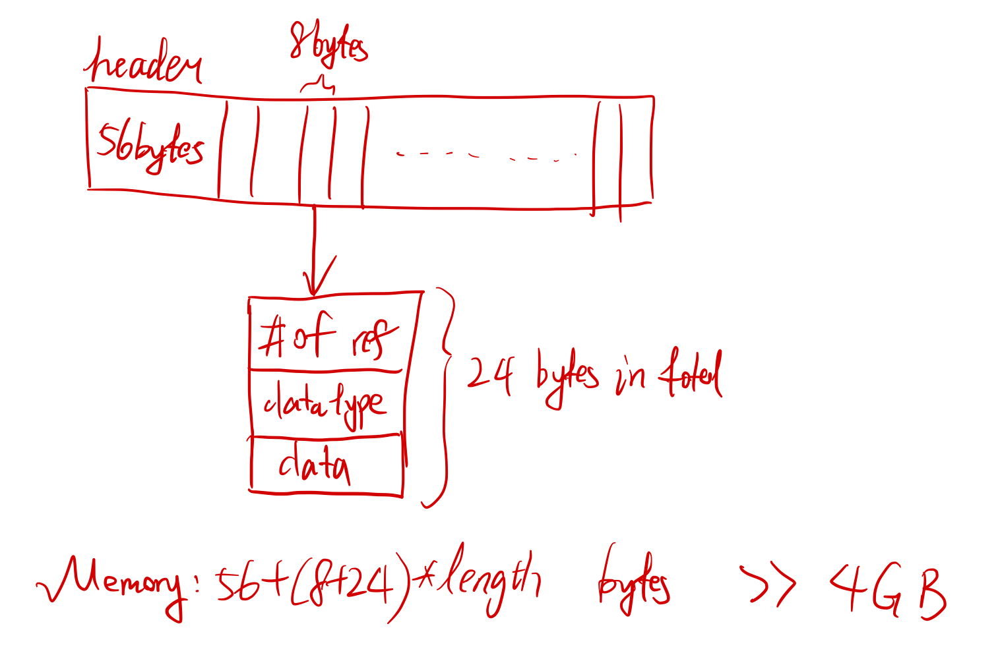
2. The program is not able to use all the 8GB RAM. Some other background activities on the computer may takes some RAM. For example, the web browser, the Microsoft Word or some other applications takes some RAM and makes the RAM available for python smaller. For detailed RAM activities, my friend can open the "Activity Monitor" and see the allocation of RAM to different programs.
3. Python is less "memory-efficient" than other programming languages. Python use Python Runtime Environment (PRE) to manage the memory that will not be used in the future and free the memory. In contrast, other languages such as C++ requires the programmer to free the memory themselves. PRE makes python uses more RAM [1]. Besides, when storing the same int number, python will use more space to store it. All these reasons makes it difficult for python to directly load the data. 

In one sentence, the file is too large, and thus my friend cannot simply load all these data into python with list which is not memory efficient enough. 

*Reference*:

[1] Zehra F, Javed M, Khan D, et al. Comparative analysis of C++ and Python in terms of memory and time[J]. 2020.

### Q2

To solve the issue while still storing all these data in memory, following methods may be helpful:

1. Ask the friend to purchase a larger RAM in the computer store nearby. Change to a 24GB RAM, for example, may be helpful.
2. It 1 is not applicable, my frient can **use array to store the value** instead of **list**, because list use much more space than array. List typically needs to store an object's value, datatype and address and refnumber, which takes 32 types in total to store one object, while array only stores the value, since all data in an array has the same datatype. 

### Q3

There is also a strategy for calculating the average that would not require storing all the data in memory. That is to change the code so that there does not exist such a giant variable. We add the newly read weight number as a sum instead of appending it into a list. Then divide the sum of weights by total number of people to calculate the average weight. 

```python
with open('weights.txt') as f:
    weights = 0
    count = 0
    for line in f:
        weights += float(line)
        count += 1
print("average =", weights / count)
```


## Exercise 2

I define a class ``Zhiyuan_BloomFilter`` to be the implementation of Bloom Filter. To initialize the class, the ``size`` of the filter should be determined. The default value is ***1e7***. In ``Zhiyuan_BloomFilter``, there are these main functions:

- ``add_element``: Add element to the filter.
- ``exist_or_not``: Detect whether an element is already in the filter.
- ``change_hash_tuple``: Change the hash function(s) to be used. 
- ``clear_all``: Clear all elements inside the filter, i.e. set all values of bitarray to be 0.

Also, there are three hash function encapsulated in the class: ``my_hash``, ``my_hash2`` and ``my_hash3``. They can be used directly as the input of  ``change_hash_tuple``. 

Then, I tested my code using the following code, the results are correct. 

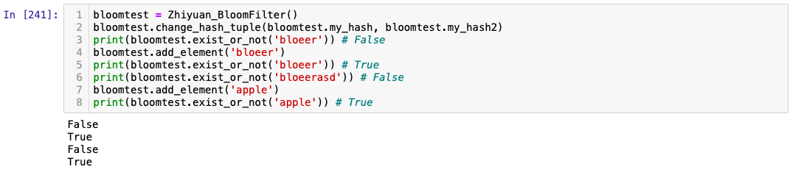

After that, I store the words in the Bloom Filter. To store the word, I define another class ``Spell_check``. In the initialization of ``Spell_check``, I read the file "words.txt" and store the words in the filter by the following codes. The following spelling correction process  will show that I store the words successfully here. 

```python
self.BFt = Zhiyuan_BloomFilter(size)
with open(file) as f:
    for line in f:
        word = line.strip()
        self.BFt.add_element(word)
```

In class ``Spell_check``, there are three parameters that can be adjusted. 

- ``size``: The size of the Bloom Filter to be initialized. Default value set as 1e7. 
- ``hash_usage``: The hash function(s) to be used. Specifically, '100' means using the first hash function, '110' means using the first and second function, and '111' means using all the three hash functions. Default value set as '111'.
- ``file``: The file name of English words. Default value set as 'words.txt'.

There are two main functions:

- ``give_suggestion``: Takes a word as input and return the suggested spell corrections. 
- ``test_accuracy``: Takes a test file as input. Return the number of good suggestions and the number of test cases in tuple. 

Now, I will test my function ``give_suggestion``. I asked my implementation to spell-check "floeer" using 1e7 bits with different hash function(s).

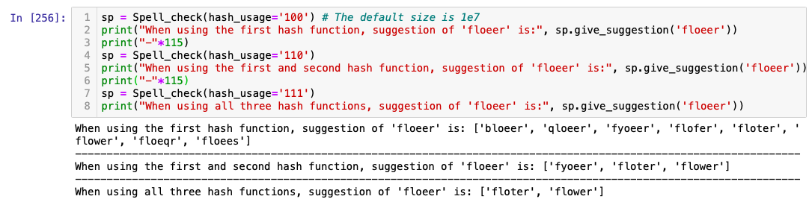

The above result is the same as the sample output. 

Next, I read the file "typos.json" and calculate the number of "good suggestions". The result is shown below. It takes pretty a long time for my old computer to calculate and collect all these data :(

|  Size  | Proportion of "good suggestions" (%) |
| :----: | :----------------------------------: |
|  1e6   |                  0                   |
|  5e6   |                  0                   |
|  8e6   |                 0.2                  |
|  9e6   |                0.316                 |
|  1e7   |                0.516                 |
|  3e7   |                26.92                 |
|  4e7   |                42.67                 |
|  5e7   |                54.82                 |
|  6e7   |                64.12                 |
|  8e7   |                75.90                 |
|  1e8   |                81.72                 |
| 1.71e8 |                90.12                 |
|  3e8   |                93.26                 |
|  5e8   |                94.09                 |
|  1e9   |                94.52                 |
|  1e10  |                94.81                 |

<center> When using hash function 1</center>

| Size  | Proportion of "good suggestions" |
| :---: | :------------------------------: |
|  1e6  |                0                 |
|  5e6  |              4.676               |
|  6e6  |              13.96               |
|  7e6  |              26.98               |
|  8e6  |              40.36               |
|  9e6  |              52.54               |
|  1e7  |              63.06               |
| 1.1e7 |              70.70               |
| 1.2e7 |              76.95               |
| 1.3e7 |              80.68               |
| 1.5e7 |              86.57               |
|  2e7  |              92.00               |
|  3e7  |              94.26               |
|  1e8  |              94.83               |
| 1e10  |              94.86               |

<center> When using hash function 1 and 2</center>

| Size  | Proportion of "good suggestions" |
| :---: | :------------------------------: |
|  1e6  |                0                 |
|  2e6  |                0                 |
|  4e6  |              7.396               |
| 4.5e6 |              16.97               |
| 4.8e6 |              25.28               |
|  5e6  |              30.64               |
| 5.5e6 |              43.53               |
| 5.8e6 |              51.82               |
|  6e6  |              56.73               |
| 6.8e6 |              71.87               |
| 7.4e6 |              79.12               |
|  8e6  |              84.14               |
|  1e7  |              91.85               |
|  5e7  |              94.84               |
|  1e8  |              94.86               |
| 1e10  |              94.86               |

<center> When using hash function 1, 2 and 3</center>

With all these data, the plot is shown below:

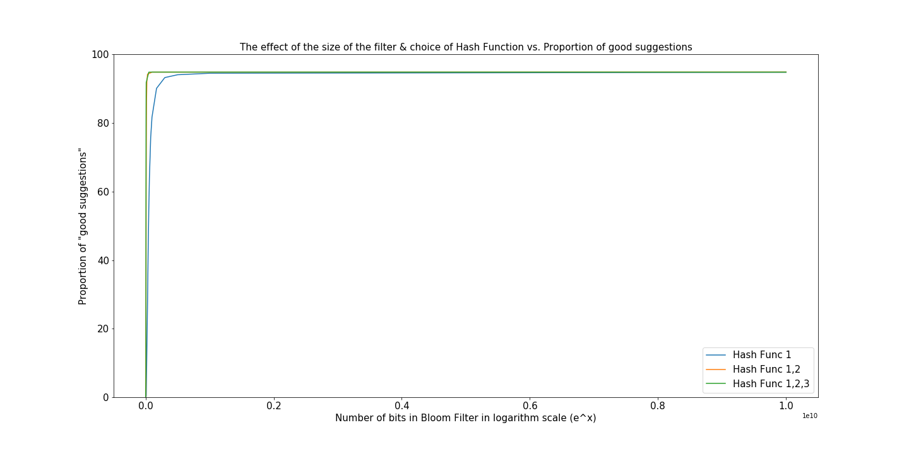

However, the x-axis has a long range, which makes the graph crowded and overlapped. Thus I take logarithm transform to the x-axis. The result is shown below.

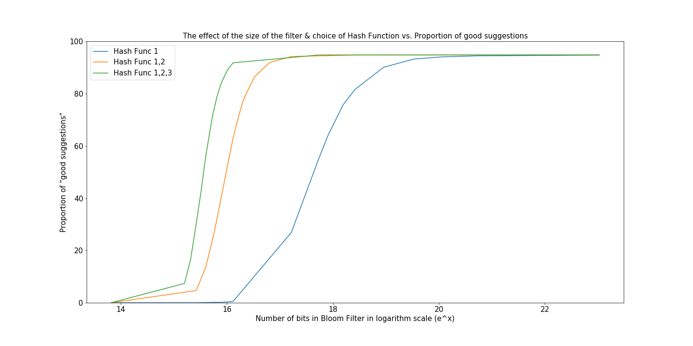

From the figure, we can see that the number of good suggestions increase with the increase of bit number size of Bloom Filter. Also, by using more hash functions, the performance of suggestions will be better, because within the same filter size, the correctness of using all three hash function is better than using the first two, which is better than using only one hash function.  

The size needed to reach 90% accuracy:

| Hash Function usage | Size needed to reach 90% |
| :-----------------: | :----------------------: |
|          1          |          1.71e8          |
|        1, 2         |          1.75e7          |
|       1, 2, 3       |          9.3e6           |

In my test, the best proformance I can achieve is **94.86%**. It seems to reach a limit using these three hash functions, since the rest suggestions, which are not considered good ones, still contains the correct answer. They are considered "not good" simply because there are more than three suggestions. Nevertheless, for many short words, there do exist more than three words which differ only one letter with each other. Below are some examples.

As said by Prof. Robert, "perfect spelling correction is impossible when considering words in isolation". If higher good suggestion rate is expected, perhaps the specific context should be considered. 


## Exercise 3

First, I extend the given code into a Binary Search Tree (BST) as shown below.

```python
class Tree:
    def __init__(self, value=None):
        self._value = value
        self.left = None
        self.right = None
```

Then, I wrote an ``add`` method so that elements can be added into the BST. Please see my code for detail. 

Next, I use some test cases to test my code. The result is shown below. 

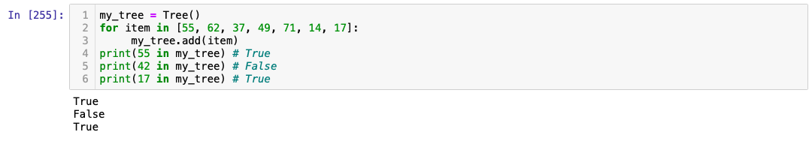

From the above test, our BST works as expected. 

After that, I change the size *n* of the BST and see the runtime of ``in``. I range the size from *10* to *49000* and test the average runtime of  ``in`` function with 1000 random numbers. The plot is shown below.

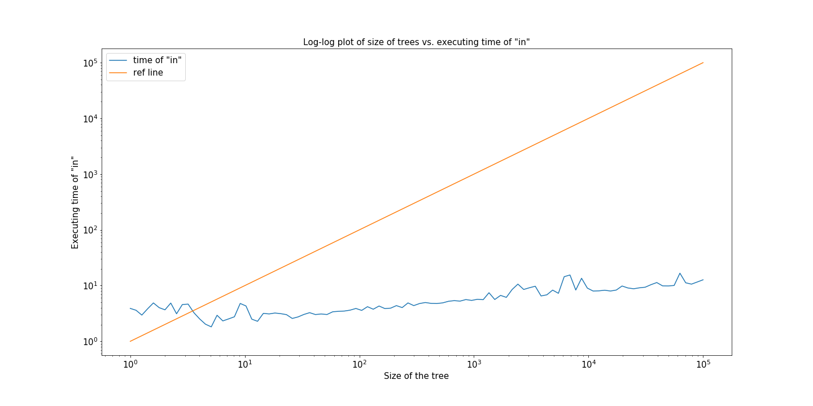

Considering the scale of its x-axis, the graph is almost horizontal. Hence, ``in`` is executing in O(log n) times.

Finally, we test the time to setup the tree by varying the tree size *n*. I found that the curve lies between a curve that is O(n) and one that is O(n**2).

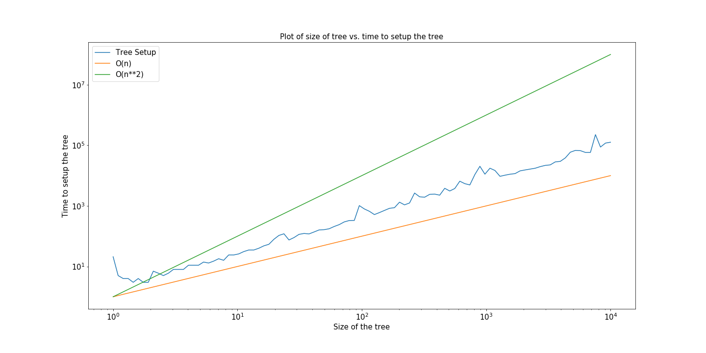

Therefore the plot serves as a supporting evidence that the time to setup the tree is O(n log n) 


## Exercise 4

**Some simple test of the algorithms**:

I did some test for these two algorithms. 

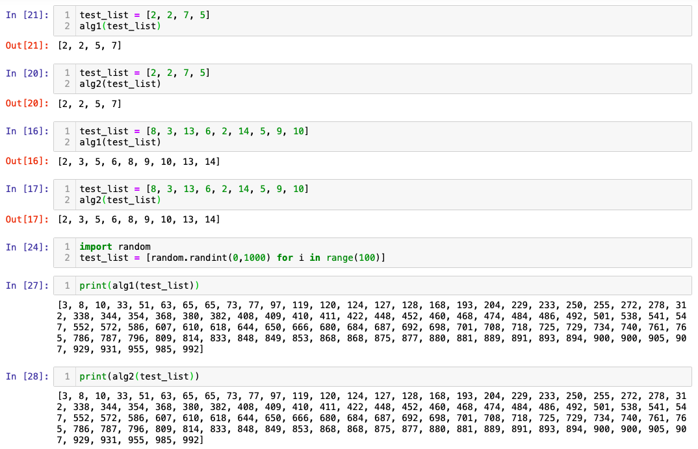

From the test result, it is clear that what the algorithm do is to sort an array in an ascending order. In other words, my **hypothesis** is that both these two algorithms are sorting algorithms, one is bubble sort and another is merge sort. 

**Explanation of how these algorithms work**: 

1. For ``alg1``, it compare the adjacent two numbers in the list iteratively. While iterating the whole list, if the tested number is larger than the second one, switch them. The whole process is stopped when no numbers are switched during one iteration.
2. For ``alg2``, it is known as "merge sort". First, the algorithm recursively split the data into two parts until all data only contains one number or less. Then, the algorithm merge two lists by recursion and finally obtain the whole array: For two list which have already been sorted, compare their smallest value and then put the smaller one into a new list. The process does not stop until one list is empty. Then concatenate the rest numbers of another list into the new list. In this way, two sorted array is merged into one sorted array. Do this by recursion and the whole array will be sorted.

**Time the performance**:

I range the size from 1 to 10,000 with **30** data points and use loglog plot to observe the time performance. 

1. For ``data1``, the plot is shown below

   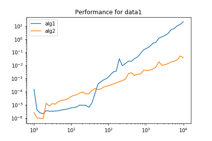

   **Description**: It can be observed that when the size of the data is getting larger, the performance of ``alg2`` is much better then ``alg1``. In other words, considering the big-O scaling, ``alg1`` is much slower than ``alg2``. 

2. For ``data2``, the plot is shown below

   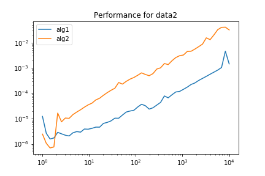

   **Description**: It can be observed that when the data is already sorted, the performance of ``alg1`` is much better than ``alg2``, because ``alg1`` will ends in one iteration, while ``alg2`` still go through the whole process.

3. For ``data3``, the plot is shown below

   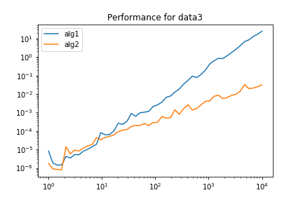

   **Description**: It can be observed that when the data is in reversed, the performance of ``alg2`` is much better than ``alg2``, because in this case ``alg1`` is the slowest. It need to switch the order for pretty long times.

**Discussion of above results**: I also plot the performance of algorithm in different dataset. As a result, ``alg1`` is good and only good at sorting data that is nearly sorted. ``alg2`` will have a stable performance regardless of how the data looks like. In conclusion, ``alg1`` is of O(n**2), while ``alg2`` is O(n\*logn).

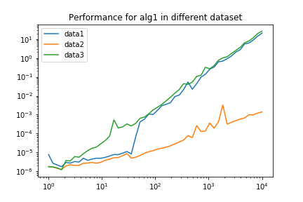

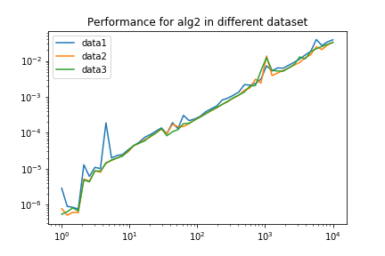

For an a arbitrary data, I will definitely choose **``alg2``** because regradless of how the data looks like, it has a **stable** performance which is already good enough. Besides, for arbitrary data, the possibility that it's nearly sorted is low, which means it is pretty difficult for ``alg1`` to have a better performance compared with ``alg2``. 
**Explanation of parallelization of alg2**:

To parallelize ``alg2``, we use ``map`` function under ``multiprocessing.Pool()``. After that, I split the data into two parts, and apply merge sort to each of them using parallel programming, i.e. the left and right of the data are sorted at the same time. Finally, we merge the two sorted sublist together. 

**Implementation of merge sort in parallel**: 

Please see my code for detailed implementation. 

Then I tested the performance of parallelized ``alg2``. The result is shown below.

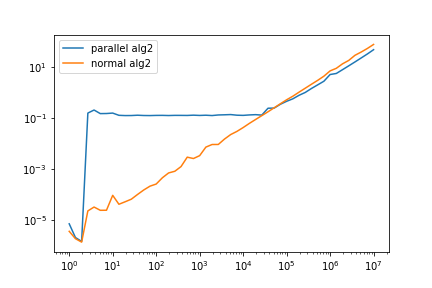

When the scale of size is small (i.e. smaller than 1e4 or 1e5), it takes some time for the ``Pool()`` to initialize. So the parallel version is slower than the normal one. But when the sclae becomes larger, things are what we expected: the parallel vesion is faster than normal version at roughly twice the speed. Specifically, we have:

| Implementation | Time spent (s) when size = 1e7 |
| :------------: | :----------------------------: |
|      alg2      |       77.20092985499991        |
| parallel alg2  |       48.06975592799995        |


## Appendix: Python Code

### Exercise 2

```python
import bitarray
from hashlib import sha3_256, sha256, blake2b
import json
import matplotlib.pyplot as plt
import numpy as np

class Zhiyuan_BloomFilter():
    
    def __init__(self, size=int(1e7)):
        self._size = size
        self._data = bitarray.bitarray(size)
        self._data.setall(0)
        self.hash_tuple = (self.my_hash, self.my_hash2, self.my_hash3)
    
    def change_hash_tuple(self, *hash_func):
        self.hash_tuple = hash_func
    
    def clear_all(self):
        self._data.setall(0)
        
    def exist_or_not(self, element):
        posi_list = self.find_position(element)
        test_idf = True
        for p in posi_list:
            test_idf = self._data[p] and test_idf
        return test_idf
        
    def add_element(self, element):
        posi_list = self.find_position(element)
        for p in posi_list:
            self._data[p] = 1
    
    def find_position(self, element):
        position_list = []
        for hash_func in self.hash_tuple:
            position_list.append(hash_func(element))
        return position_list
    
    def my_hash(self, s):
        return int(sha256(s.lower().encode()).hexdigest(), 16) % self._size
    
    def my_hash2(self, s):
        return int(blake2b(s.lower().encode()).hexdigest(), 16) % self._size

    def my_hash3(self, s):
        return int(sha3_256(s.lower().encode()).hexdigest(), 16) % self._size

    

class Spell_check():
    
    def __init__(self, size=int(1e7), hash_usage='111', file='words.txt'):
        self.BFt = Zhiyuan_BloomFilter(size)
        if hash_usage =='100':
            self.BFt.change_hash_tuple(self.BFt.my_hash)
        elif hash_usage =='110':
            self.BFt.change_hash_tuple(self.BFt.my_hash, self.BFt.my_hash2)
        with open(file) as f:
            for line in f:
                word = line.strip()
                self.BFt.add_element(word)
    
    def potential_suggestion(self, word):
        output_list = [word]
        word_split = list(word)
        for i in range(len(word_split)):
            word_temp = word_split.copy()
            if (word_split[i].isupper()):
                for j in range(65, 91):
                    word_temp[i] = chr(j)
                    output_list.append("".join(word_temp))
            elif (word_split[i].islower()):
                for j in range(97, 123):
                    word_temp[i] = chr(j)
                    output_list.append("".join(word_temp))
        # Delete the duplicate elements while keeping the order unchanged 
        output_list_nodup = list(set(output_list))
        output_list_nodup.sort(key=output_list.index)
        return output_list_nodup
    
    def give_suggestion(self, word):
        output_list = []
        Lreplacement_list = self.potential_suggestion(word)
        for item in Lreplacement_list:
            if self.BFt.exist_or_not(item):
                output_list.append(item)
        return output_list
    
    def test_accuracy(self, file='typos.json'):
        with open(file,'r') as f:
            load_dict = json.load(f)
        count = 0
        correct = 0
        for word_list in load_dict:
            ans = sp.give_suggestion(word_list[0])
            count += 1
            if (len(ans) <= 3 and word_list[1] in ans):
                correct += 1
        return (correct, count)
```

```python
bloomtest = Zhiyuan_BloomFilter()
bloomtest.change_hash_tuple(bloomtest.my_hash, bloomtest.my_hash2)
print(bloomtest.exist_or_not('bloeer')) # False
bloomtest.add_element('bloeer')
print(bloomtest.exist_or_not('bloeer')) # True
print(bloomtest.exist_or_not('bloeerasd')) # False
bloomtest.add_element('apple')
print(bloomtest.exist_or_not('apple')) # True
```

```python
sp = Spell_check(hash_usage='100') # The default size is 1e7
print("When using the first hash function, suggestion of 'floeer' is:", sp.give_suggestion('floeer'))
print("-"*115)
sp = Spell_check(hash_usage='110') 
print("When using the first and second hash function, suggestion of 'floeer' is:", sp.give_suggestion('floeer'))
print("-"*115)
sp = Spell_check(hash_usage='111') 
print("When using all three hash functions, suggestion of 'floeer' is:", sp.give_suggestion('floeer'))
```

```python
# Collect the number of "good suggestions"
sp = Spell_check(hash_usage='111', size=int(5.8e6))
sp.test_accuracy()
```

```python
x1 = [1e6, 5e6, 8e6, 9e6, 1e7, 3e7, 4e7, 5e7, 6e7, 8e7, 1e8, 5e8, 1e9, 1e10]
y1 = [0, 0, 63, 118, 201, 11246, 18193, 23751, 28151, 33797, 36915, 43889, 44254, 44503]
x2 = [1e6, 5e6, 6e6, 7e6, 8e6, 9e6, 1e7, 1.1e7, 1.2e7, 1.3e7, 1.5e7, 2e7, 3e7, 1e8, 1e10]
y2 = [1, 1835, 5561, 11213, 17099, 22831, 27714, 31408, 34430, 36412, 39469, 42479, 43914, 44490, 44531]
x3 = [1e6, 4e6, 4.5e6, 4.8e6, 5e6, 5.5e6, 5.8e6, 6e6, 6.8e6, 7.4e6, 8e6, 1e7, 5e7, 1e8, 1e10]
y3 = [1, 2868, 6935, 10357, 12740, 18736, 22451, 24753, 32017, 35478, 38211, 42353, 44517, 44531, 44531]
plt.figure(figsize=(20,10))
plt.plot(np.log(x1), y1,label='Hash Func 1')
plt.plot(np.log(x2), y2,label='Hash Func 1,2')
plt.plot(np.log(x3), y3,label='Hash Func 1,2,3')
#plt.plot(x1, y1,label='Hash Func 1')
#plt.plot(x2, y2,label='Hash Func 1,2')
#plt.plot(x3, y3,label='Hash Func 1,2,3')
plt.ylim([0, 50000])
plt.xticks(fontsize=15)
plt.yticks(fontsize=15)
plt.legend(fontsize=15)
plt.xlabel('Number of bits in Bloom Filter in logarithm scale (e^x)', fontsize=15)
plt.ylabel('Number of "good suggestions"', fontsize=15)
plt.title('The effect of the size of the filter & choice of Hash Function vs. Number of good suggestions', fontsize=15)
plt.savefig('README_img/EX2_4.png')
plt.show()
```

### Exercise 3

```python
class Tree:
    def __init__(self, value=None):
        self._value = value
        self.left = None
        self.right = None
    
    def add(self, num):
        if self._value == None:
            self._value = num
        elif num < self._value: # Insert to the left
            if self.left == None:
                self.left = Tree(num)
            else: 
                self.left.add(num)
        elif num > self._value: # Insert to the right
            if self.right == None:
                self.right = Tree(num)
            else: 
                self.right.add(num)
    
    def __contains__(self, item):
        if self._value == item:
            return True
        elif self.left and item < self._value:
            return item in self.left
        elif self.right and item > self._value:
            return item in self.right
        else:
            return False
```

```python
my_tree = Tree()
for item in [55, 62, 37, 49, 71, 14, 17]:
     my_tree.add(item)
print(55 in my_tree) # True
print(42 in my_tree) # False
print(17 in my_tree) # True
```

```python
import random
import datetime
import matplotlib.pyplot as plt 
import numpy as np

def check_time(n):
    tree = Tree()
    for i in range(n):
        tree.add(random.randint(0,n))
    start = datetime.datetime.now()
    for i in range(1000):
        random.randint(0,n) in tree
    end = datetime.datetime.now()
    return (end - start).microseconds / 1000

x = np.logspace(0, 4, 100)
y = []
for item in x:
    y.append(check_time(int(item)))
plt.figure(figsize=(20,10))
plt.loglog(x, y)
plt.xticks(fontsize=15)
plt.yticks(fontsize=15)
plt.xlabel('Size of the tree', fontsize=15)
plt.ylabel('Executing time of "in"', fontsize=15)
plt.title('Log-log plot of size of trees vs. executing time of "in"', fontsize=15)
plt.savefig('README_img/EX3_2.png')
plt.show()
```

```python
import random
import datetime
import matplotlib.pyplot as plt 
import numpy as np

def check_time(n):
    start = datetime.datetime.now()
    tree = Tree()
    for i in range(n):
        tree.add(random.randint(0,n))
    end = datetime.datetime.now()
    return (end - start).microseconds

x = np.logspace(0, 4, 100)
y = []
for item in x:
    y.append(check_time(int(item)))
plt.figure(figsize=(20,10))
plt.loglog(x,y, label='Tree Setup')
plt.loglog(x,x, label='O(n)')
plt.loglog(x,[a**2 for a in x], label='O(n**2)')
plt.xlabel('Size of the tree', fontsize=15)
plt.ylabel('Time to setup the tree', fontsize=15)
plt.title('Plot of size of tree vs. time to setup the tree', fontsize=15)
plt.xticks(fontsize=15)
plt.yticks(fontsize=15)
plt.legend(fontsize=15)
plt.savefig('README_img/EX3_3.png')
plt.show()
```

### Exercise 4

```python
import numpy as np
from time import perf_counter
import matplotlib.pyplot as plt
from tqdm import tqdm
timelist_alg1 = []
timelist_alg2 = []
sizes = np.logspace(0, 4)
for n in tqdm(sizes):
    n = int(n)
    X_test = data1(n)
    start = perf_counter()
    alg1(X_test)
    end = perf_counter()
    timelist_alg1.append(end-start)
    
    X_test = data1(n)
    start = perf_counter()
    alg2(X_test)
    end = perf_counter()
    timelist_alg2.append(end-start)

plt.loglog(sizes, timelist_alg1, label='alg1')
plt.loglog(sizes, timelist_alg2, label='alg2')
plt.title('Performance for data1')
plt.legend()
plt.savefig("README_img/EX4_2.png")
plt.show()
```

```python
import numpy as np
from time import perf_counter
import matplotlib.pyplot as plt
from tqdm import tqdm
timelist_data1 = []
timelist_data2 = []
timelist_data3 = []
sizes = np.logspace(0, 4)
for n in tqdm(sizes):
    n = int(n)
    X_test = data1(n)
    start = perf_counter()
    alg1(X_test)
    end = perf_counter()
    timelist_data1.append(end-start)
    
    n = int(n)
    X_test = data2(n)
    start = perf_counter()
    alg1(X_test)
    end = perf_counter()
    timelist_data2.append(end-start)
    
    X_test = data3(n)
    start = perf_counter()
    alg1(X_test)
    end = perf_counter()
    timelist_data3.append(end-start)

plt.loglog(sizes, timelist_data1, label='data1')
plt.loglog(sizes, timelist_data2, label='data2')
plt.loglog(sizes, timelist_data3, label='data3')
plt.title('Performance for alg1 in different dataset')
plt.legend()
plt.savefig("README_img/EX4_5.png")
plt.show()
```

```python
#%%
import multiprocessing
import numpy as np
from time import perf_counter
import matplotlib.pyplot as plt

def merge(d1, d2):
    result = []
    # note: this takes the top items off the left and right piles
    left_top = next(d1)
    right_top = next(d2)
    while True:
        if left_top < right_top:
            result.append(left_top)
            try:
                left_top = next(d1)
            except StopIteration:
                # nothing remains on the left; add the right + return
                return result + [right_top] + list(d2)
        else:
            result.append(right_top)
            try:
                right_top = next(d2)
            except StopIteration:
                # nothing remains on the right; add the left + return
                return result + [left_top] + list(d1)

def alg2(data):
    if len(data) <= 1:
        return data
    else:
        split = len(data) // 2
        left = iter(alg2(data[:split]))
        right = iter(alg2(data[split:]))
        return merge(left, right)

def data1(n, sigma=10, rho=28, beta=8/3, dt=0.01, x=1, y=1, z=1):
    import numpy
    state = numpy.array([x, y, z], dtype=float)
    result = []
    for _ in range(n):
        x, y, z = state
        state += dt * numpy.array([
            sigma * (y - x),
            x * (rho - z) - y,
            x * y - beta * z
        ])
        result.append(float(state[0] + 30))
    return result

def data2(n):
    return list(range(n))

def data3(n):
    return list(range(n, 0, -1))

def para_alg2(datalist):
    if len(datalist) <= 1:
        return datalist
    else: 
        split = len(datalist) //2
        with multiprocessing.Pool() as p:
            results = p.map(alg2, [datalist[:split], datalist[split:]])
        return merge(iter(results[0]), iter(results[1]))

if __name__ == '__main__': 
    xList = np.logspace(0, 7)
    resultList1 = []
    resultList2 = []
    for x in xList:
        x = int(x)
        datalist = data1(x)
        start = perf_counter()
        para_alg2(datalist)
        end = perf_counter()
        resultList1.append(end-start)

        datalist = data1(x)
        start = perf_counter()
        alg2(datalist)
        end = perf_counter()
        resultList2.append(end-start)
    plt.loglog(xList, resultList1, label='parallel alg2')
    plt.loglog(xList, resultList2, label='normal alg2')
    plt.legend()
    plt.savefig("EX4_7.png")
    plt.show()
 
# %%
print(resultList1[-1])
print(resultList2[-1])
# %%
```

